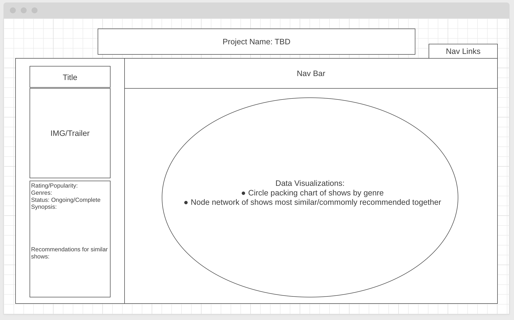

# Background
The world of anime is evergrowing and vast. 

# Functionality & MVPs
* View data visualization 
* Use search functionality

# Wireframes

# Technologies, Libraries, APIs
* d3.js (https://d3js.org/)
* Jikan API (https://docs.api.jikan.moe/)

# Implementation Timeline

# Friday / Weekend
* research D3
* fetch API data
* sidebar/navbar 

# Monday
* DOM manipulation: eventlisteners for click (navbar/circle/nodes/search)

# Tuesday
* CSS styling

# Wednesday
* Testing 

# Thursday 
* Final touches
* Deploy to GitHub pages
* Update README

