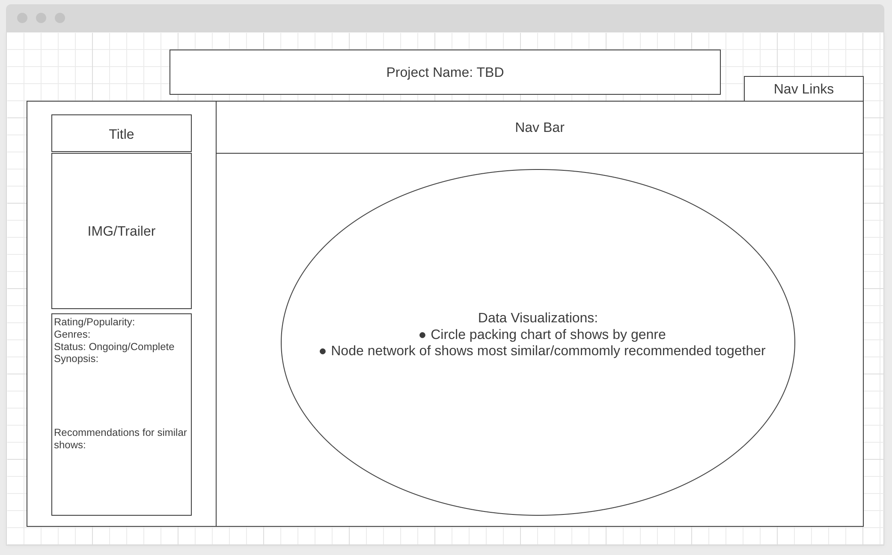
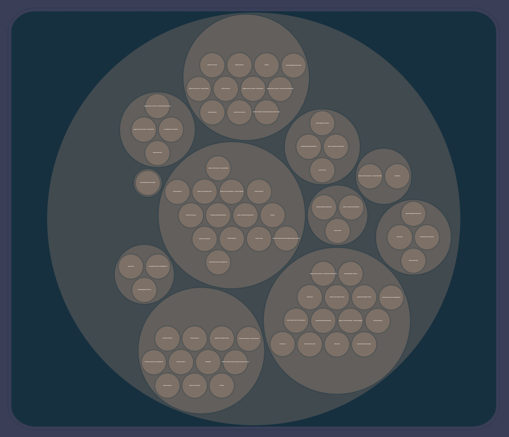

# Background
[AniView](https://mzhanggg.github.io/AniView/) provides data visualizations for the top 25 rated shows with data fetched from MyAnimeList(MAL), the world's most active online anime and manga community and database via JikanAPI. 

Users are greeted with a homepage with options to choose between 2 visualizations via the categories of top rated anime or genre. Upon selecting an option, users can further interact with the bar graph by selecting a data point, which dynamically populates the sidebar.

# Wireframes


# Functionality & MVPs
Users are currently presented with 2 visualizations sorted by top anime and genre.

**Top Anime:**
- Selecting the category of 'Top Anime' will generate a bar graph of the top 25 rated animes compared to MAL user data of the show's favorite count
- Selecting a data point on the bar graph will dynamically populate the sidebar with additional information on the data point. This includes: title, synopsis, genres, score, rating, status and user favorite count.


**Genres:**
- Selecting the category of 'Genre' will generate a circle packing graph of the top 25 rated anime organized by genres.


# Implementation
Data populating the graphs and the sidebars come from asynchronous fetches to Jikan API, which is then parsed and returned to a corresponding asynchronous function that displays the information.

``` js
async function fetchTopAnime() {
    const response = await fetch(`https://api.jikan.moe/v4/top/anime`);
    const data = await response.json();
    const animeDetails = [];

    data.data.forEach(datum => {
        const title = datum.title_english;
        const genres = datum.genres;
        const favoritesCount = datum.favorites;
        const id = datum.mal_id;
        
        animeDetails.push({title, genres, favoritesCount, id});
    });

    return animeDetails;
}
```

# Technologies, Libraries, APIs
- All visualizations were implemented with the [D3 API](https://d3js.org/)
- Data was pulled from [Jikan API](https://docs.api.jikan.moe/)

# Future Implementations  
- Data visualization of genres: Currently, the circle-packing graph of top animes grouped by genre is difficult to parse. I plan to make the graph dynamic and interactive with a zoomable feature.


